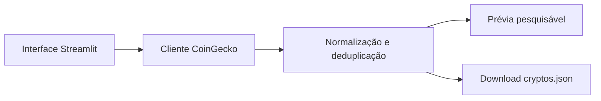

<div align="center">

# 🪙 cryptos.json Studio

### Um gerador elegante de catálogos de criptomoedas, pronto para rodar no Streamlit.

[](https://www.python.org/)
[](https://streamlit.io/)
[](https://www.coingecko.com/)
[](https://github.com/leonardo-deploy/cryptos.json/actions/workflows/ci.yml)

Transforme dados de mercado da CoinGecko em um arquivo `cryptos.json` limpo, pesquisável e disponível para download — diretamente pelo navegador.

</div>

---

## ✨ O que o projeto oferece

- Interface moderna e responsiva construída com Streamlit.
- Coleta em ordem decrescente de valor de mercado, sem corte mínimo de capitalização.
- Coleta de 40 páginas de 250 ativos, mesmo quando uma página vem incompleta ou vazia. IDs duplicados são removidos; símbolos iguais de moedas distintas são preservados.
- Escolha entre BRL, USD e EUR como moeda de referência.
- Progresso da coleta em tempo real e mensagens de erro amigáveis.
- Contadores ao vivo de páginas, criptos consultadas e segundos restantes entre páginas e blocos.
- Cinco tentativas por página, pausa especial para HTTP 429 e continuidade após falhas persistentes.
- Coleta em blocos de quatro páginas, com pausa adicional de 60 segundos entre blocos.
- Pesquisa e prévia tabular antes do download.
- JSON UTF-8, versionado e ordenado por capitalização de mercado.
- Ranking sequencial de fallback para ativos sem posição informada pela CoinGecko.
- Compatibilidade com o campo legado `current_price_brl` quando a moeda é BRL.
- Modo CLI para automações e rotinas locais.
- Núcleo modular, testes automatizados e configuração pronta para deploy.
- Integração contínua no GitHub Actions para testes e lint em cada pull request.

## 🖥️ Como funciona

1. Selecione BRL; a coleta consulta páginas de 250 ativos em ordem decrescente de valor de mercado.
2. A coleta percorre as 40 páginas, incluindo ativos abaixo de R$ 1.000.000 ou sem market cap informado. O total pode ser menor que 10.000 por disponibilidade, duplicatas e registros sem preço válido.
3. Opcionalmente, informe uma chave Demo da CoinGecko.
4. Clique em **Gerar catálogo** e acompanhe o progresso.
5. Pesquise e confira os resultados na prévia.
6. Clique em **Baixar cryptos.json** para usar o arquivo em outros sistemas.



## 📦 Estrutura do JSON

```json
{
  "schema_version": 1,
  "last_updated_timestamp": "2026-08-24T09:00:00-03:00",
  "source": "CoinGecko",
  "vs_currency": "brl",
  "total": 1,
  "cryptos": [
    {
      "id": "bitcoin",
      "symbol": "BTC",
      "name": "Bitcoin",
      "display_name": "BTC - Bitcoin",
      "image": "https://...",
      "current_price": 350000,
      "current_price_brl": 350000,
      "market_cap_rank": 1,
      "market_cap": 6900000000000,
      "total_volume": 180000000000,
      "price_change_percentage_24h": 1.25
    }
  ]
}
```

> Os valores acima são apenas ilustrativos. O arquivo baixado contém os dados disponíveis no momento da geração.

## 🚀 Executar localmente

Requisitos: Python 3.11 ou superior e Git.

```bash
git clone https://github.com/leonardo-deploy/cryptos.json.git
cd cryptos.json
python -m venv .venv
```

Ative o ambiente virtual:

```bash
# Linux/macOS
source .venv/bin/activate

# Windows (PowerShell)
.venv\Scripts\Activate.ps1
```

Instale e inicie:

```bash
pip install -r requirements.txt
streamlit run app.py
```

O navegador abrirá em `http://localhost:8501`.

## ☁️ Deploy no Streamlit Community Cloud

1. Acesse [share.streamlit.io](https://share.streamlit.io/).
2. Entre com a conta que possui acesso ao repositório.
3. Clique em **Create app**.
4. Escolha este repositório e a branch `main`.
5. Em **Main file path**, informe `app.py`.
6. Clique em **Deploy**.

O Streamlit instalará automaticamente as dependências de `requirements.txt`.

### Chave CoinGecko opcional

O app funciona sem chave, mas a chave Demo pode oferecer limites mais previsíveis. No Streamlit Cloud, abra **App settings → Secrets** e adicione:

```toml
COINGECKO_API_KEY = "sua-chave-demo"
```

Também é possível usar a variável de ambiente `COINGECKO_API_KEY` localmente. A chave nunca é gravada no JSON.

## ⌨️ Gerar pelo terminal

```bash
python gerar_cryptos_json.py --currency brl --output cryptos.json
```

Parâmetros disponíveis:

| Parâmetro | Padrão | Descrição |
|---|---:|---|
| `--currency` | `brl` | Moeda: `brl`, `usd` ou `eur` |
| `--delay` | `30.0` | Intervalo em segundos entre páginas (mínimo de 30) |
| `--block-delay` | `60.0` | Pausa adicional entre blocos de quatro páginas (mínimo de 60) |
| `--output` | `cryptos.json` | Caminho do arquivo de saída |

## 🌐 Interface web e app instalável

Além da versão Streamlit, o projeto tem uma interface estática publicada no
Cloudflare Pages (`index.html`), com a mesma coleta rodando no navegador:

- Tema escuro com tipografia Inter self-hosted e animações GSAP que respeitam
  `prefers-reduced-motion`.
- Instalável no celular: o `manifest.webmanifest` e o `apple-touch-icon` apontam
  para os ícones da marca, então o atalho na tela de início aparece com o logo.
- Funciona offline depois da primeira visita — `sw.js` guarda o app shell e nunca
  cacheia `/api/*`.
- `Content-Security-Policy` restrita a `'self'`, sem script ou estilo inline.

Detalhes de deploy, cabeçalhos e geração dos ícones estão em
[`CLOUDFLARE.md`](CLOUDFLARE.md).

## 🧪 Qualidade do código

```bash
pip install -r requirements-dev.txt
pytest -q
ruff check .
```

Validações da versão web:

```bash
node --check collection-policy.js && node --check app.js
node --test tests/test_collection_policy.cjs tests/test_markets_function.mjs tests/test_web_assets.mjs
```

## 🗂️ Organização

```text
.
├── .streamlit/config.toml    # Tema e configuração do servidor
├── app.py                    # Interface Streamlit
├── gerar_cryptos_json.py     # Interface de linha de comando
├── index.html                # Interface web (Cloudflare Pages)
├── styles.css                # Tema Crypto Midnight
├── app.js                    # Coleta paginada, prévia e download
├── animations.js             # Animações GSAP
├── pwa.js / sw.js            # Instalação no celular e cache do app shell
├── manifest.webmanifest      # Nome, cores e ícones do app instalado
├── _headers                  # CSP e demais cabeçalhos de segurança
├── assets/                   # Logo, ícones, favicon e fonte Inter
├── vendor/gsap/              # GSAP e ScrollTrigger self-hosted
├── tools/generate_icons.py   # Gera os PNGs da marca a partir do logo
├── functions/api/markets.js  # Proxy edge para a CoinGecko
├── src/
│   ├── coingecko.py          # Cliente HTTP resiliente
│   └── exporter.py           # Normalização e serialização
├── tests/                    # Testes automatizados
└── requirements.txt          # Dependências de produção
```

## 🔌 Uso em outra aplicação

Depois do download, hospede o arquivo junto à sua aplicação ou carregue-o diretamente:

```python
import json

with open("cryptos.json", encoding="utf-8") as file:
    catalog = json.load(file)

bitcoin = next(coin for coin in catalog["cryptos"] if coin["id"] == "bitcoin")
print(bitcoin["display_name"])
```

## ℹ️ Fonte e limites

Os dados são fornecidos pela [CoinGecko API](https://docs.coingecko.com/reference/coins-markets). A disponibilidade e a frequência permitida dependem do plano e dos limites vigentes da API. O projeto implementa timeout, retentativas, intervalos configuráveis, coleta de 40 páginas com 250 ativos por página, sem filtro de capitalização, mas a API ainda pode responder com HTTP 429.

---

<div align="center">
  Feito para transformar dados cripto em integrações simples, confiáveis e reutilizáveis.
</div>
